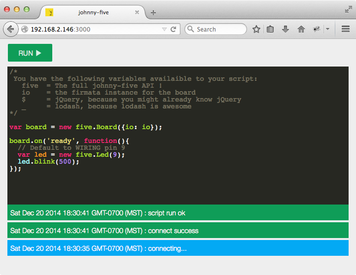

Remote Pi
=======
This app runs on a raspberry Pi allowing you remote access via a webrowser to
 run [Johnny-Five](https://github.com/rwaldron/johnny-five) programs.

It is uses [raspi-io](https://github.com/bryan-m-hughes/raspi-io) wrapped with [remote-io](https://github.com/monteslu/remote-io).  The hardware is exposed via the [scoket.io-serial](https://github.com/monteslu/socket.io-serial) transport to the self hosted browser app or to any other node client that wishes to connect to it.



# Getting Started

This takes about half an hour on my Model A+ pi (and you may need to run it a couple of times if the install doesnt finish):
```
npm install
````

Then you need to build the web UI:
```
npm run build
```

Then you'll need to sudo to access the GPIOs:
```
sudo node server
```

Then open a browser to the pi's IP: http://MY_PI_ADDRESS:3000

Your robots code will be running in the browser, but remote controlling the pins on the Raspberry Pi!
